# assemblerPractices
practices with assembler for 16bit x86

To compile needs TASM and TLINK as linker

in command line:
```
c:\> tasm program.asm

c:\> tlink program.obj
```

this generates an executable file: program.exe


## Login window view

wait for a username and password. Doesn't validate it

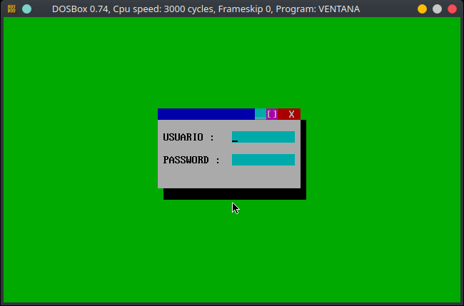

## Amarok player logo

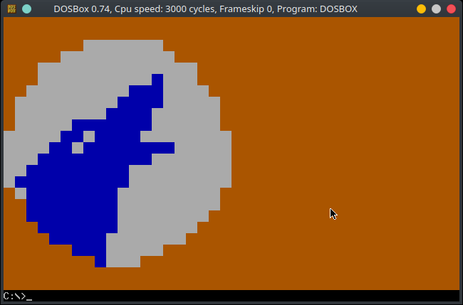

## Pac man

A pacman animation

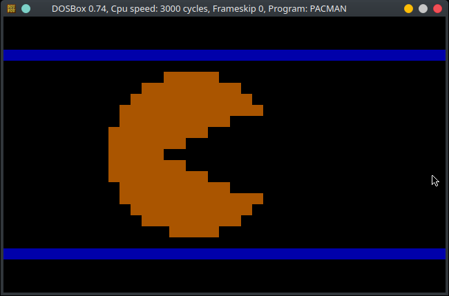

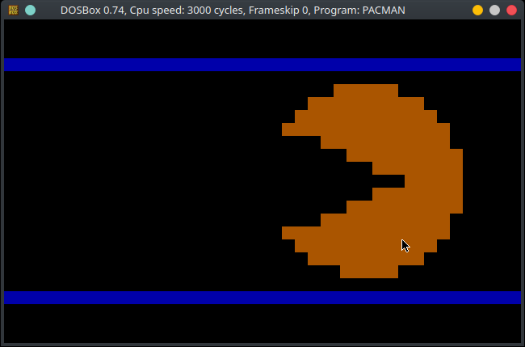

## Pac man ghost

The cutte ghost of the game moving from left to right

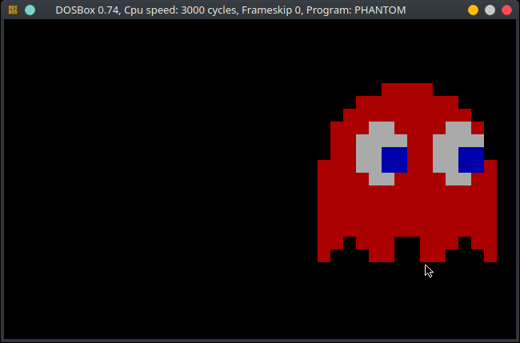

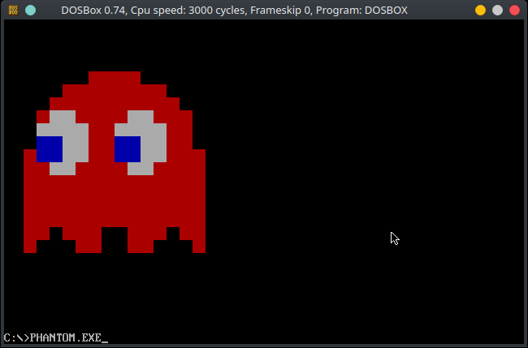

## Palindrome

waits for a string and invert it telling you if is a palindrome

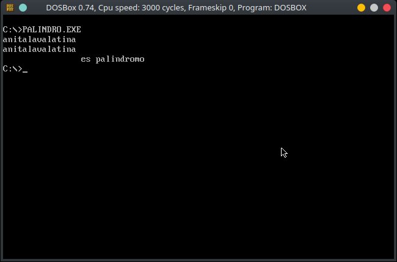

## Turbo C window

A simple image recreated with squares and text

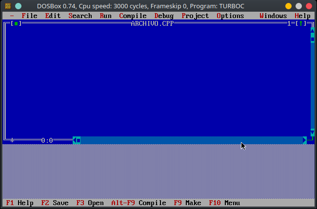

## ADO tickets

Mexican transportist. The practice is for receive data from keyboard

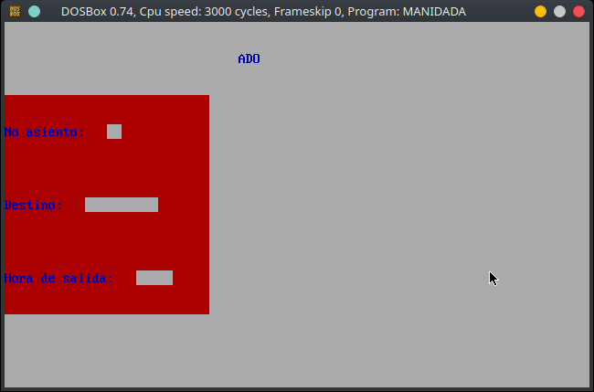

## Color picker

waits for a letter and change the indicated color

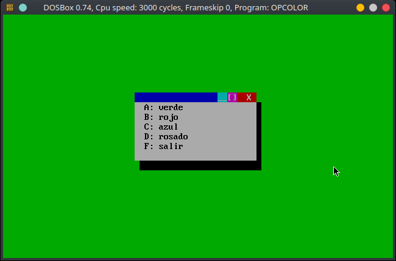

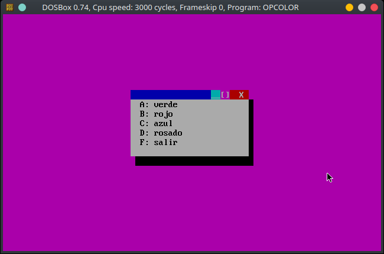


** I dont own the rigths of the images or trademarks, they only are used for educational purposes **
